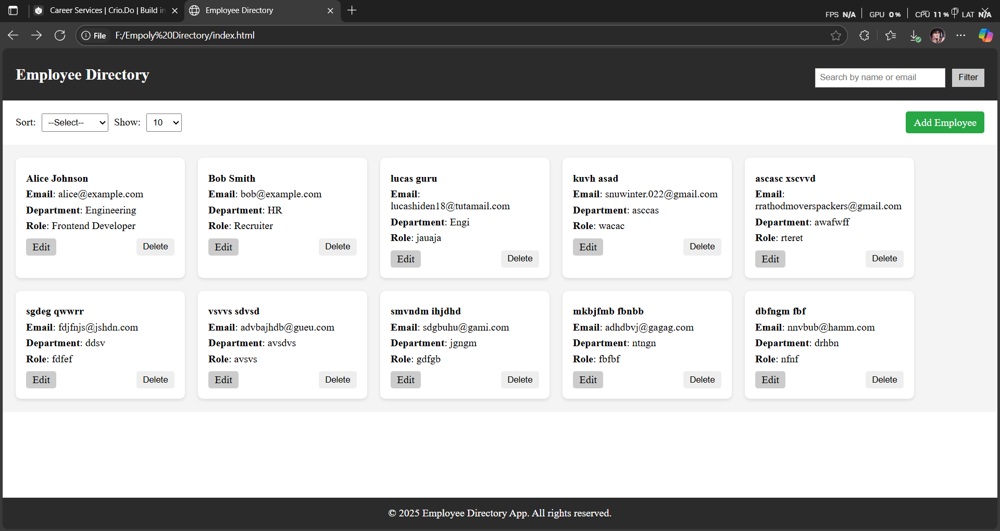
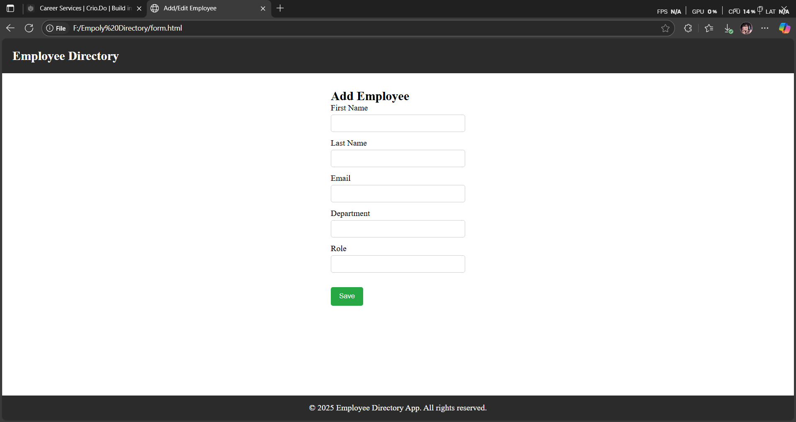

# Employee Directory - Freemarker UI Assignment

This is a responsive and interactive Employee Directory web app built using **HTML, CSS, JavaScript**, and **Freemarker templates**. It allows users to view, search, sort, and manage employee records.

## Features

- Responsive Dashboard
- Add/Edit Employee Form
- Client-side Search & Sort
- Freemarker templating using `<#list>` and `${}` syntax
- clean UI

## Folder Structure

index.ftl → Dashboard page
form.ftl → Add/Edit form
css/styles.css → Main styling
js/main.js → Dashboard logic
js/form.js → Form validation

## How to Run
Running the Project (Freemarker Setup)
This project uses .ftl (Freemarker) templates. You can run it in any Java-based environment that supports Freemarker, such as:
A simple Java + Freemarker Maven setup
Or just simulate the output locally by renaming .ftl to .html and viewing in the browser
For this project, no backend was used — data is mocked within the templates using <#assign>.
I tested the .ftl files locally by simulating Freemarker in IntelliJ with static data for UI purposes.

##  Screenshots

### Employee List (Dashboard)

### Add/Edit Employee Form

## Notes

- Purely frontend (no backend/API).
- Freemarker used to inject mock data.
